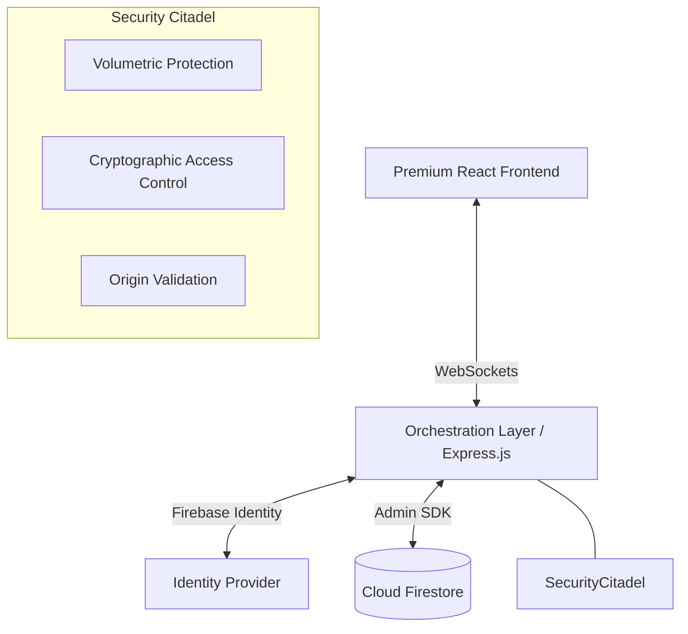

# 🎧 DJ Night: Premium Real-Time Booking Ecosystem

**Orchestrating World-Class Talent with Surgical Precision.**

[](https://www.typescriptlang.org/)
[](https://reactjs.org/)
[](https://vitejs.dev/)
[](https://nodejs.org/)
[](https://firebase.google.com/)

DJ Night is a high-performance, full-stack orchestration platform designed for premium event booking. It bridges the gap between elite musical talent and high-end event organizers using a low-latency, event-driven architecture and a state-of-the-art user interface.

---

## 🏛️ Ecosystem Architecture

The platform follows a **decoupled, event-driven architecture** ensures seamless synchronization and enterprise-grade scalability.



---

## ✨ Frontend Brilliance: Modern Glassmorphic UI

The frontend is a **state-of-the-art Single Page Application (SPA)** built for visual excellence and interactive fluidness.

- **🎨 Rich Aesthetics**: Implements a curated dark-mode design system with **vibrant gradients**, **glassmorphism**, and **smooth micro-animations**.
- **🎫 Dynamic Onboarding**: A premium signup experience featuring interactive **Role Assignment** tiles (Music Lover vs. DJ Professional).
- **🔄 Session Resilience**: Global authentication state managed via **React Context API**, ensuring persistent sessions and protected route integrity.
- **⚡ Performance First**: Built on **Vite** for sub-second hot module replacement and optimized production builds.

---

## ⚙️ Backend Excellence: High-Performance Engine

The backend is a **robust, type-safe API engine** designed for reliability and cryptographic security.

- **📡 Real-Time Orchestration**: Leverages **WebSockets (Socket.io)** for instantaneous booking state transitions and bidirectional data flow.
- **🛡️ Multi-Layered Security**:
    - **Identity Toolkit Integration**: Direct integration with Firebase Identity for secure, password-less and credential-based authentication.
    - **RBAC Citadel**: Strict Role-Based Access Control enforcing granular permissions (User, DJ, Admin).
    - **Volumetric Limiting**: Intelligent rate limiting categorized by global traffic and sensitive authentication vectors.
- **📊 Business Intelligence**: Integrated **Analytics Pipeline** providing DJs with real-time revenue metrics and booking conversion insights.
- **💡 Standardized Communication**: Employs a **Unified Response Utility** for consistent, predictable API behavior across all endpoints.

---

## 🛠️ Technology Stack

| Layer | Technologies |
| :--- | :--- |
| **Frontend** | React 19, TypeScript, Vite, React Router, Axios, Lucide Icons |
| **Backend** | Node.js (ESM), Express.js, Firebase Admin SDK, Socket.io |
| **Database** | Google Cloud Firestore (NoSQL) |
| **Security** | JWT, Express-Rate-Limit, CORS, Firebase Auth |

---

## 🚀 Rapid Deployment

### 1. Build & Setup
```bash
git clone https://github.com/NITESH-DANGI/DJ-night.git
cd DJ-night
# Install ecosystem dependencies
(cd backend && npm install)
(cd frontend && npm install)
```

### 2. Environment Tuning
Configure the `.env` in the `backend/` directory:
```env
PORT=5000
FIREBASE_API_KEY=your_web_api_key
```

### 3. Execution Engines
- **Backend Hub**: `npm run dev` (from /backend)
- **Frontend SPA**: `npm run dev` (from /frontend)

---

## 📡 API Technical Reference

| Domain | Protocol | Endpoint | Description |
| :--- | :---: | :--- | :--- |
| **Identity** | REST | `/api/auth/*` | Cryptographic onboarding and login |
| **Talent** | REST | `/api/djs/*` | Discover and filter the global DJ pool |
| **Transactions** | REST/WS | `/api/bookings/*` | Asynchronous booking lifecycle management |
| **Intelligence** | REST | `/api/admin/*` | System orchestration and analytics |

---

## 📜 Professional Standard

Distributed under the **ISC License**. Designed for the global music community with a focus on **Visual Design, Real-Time Performance, and Security.**
