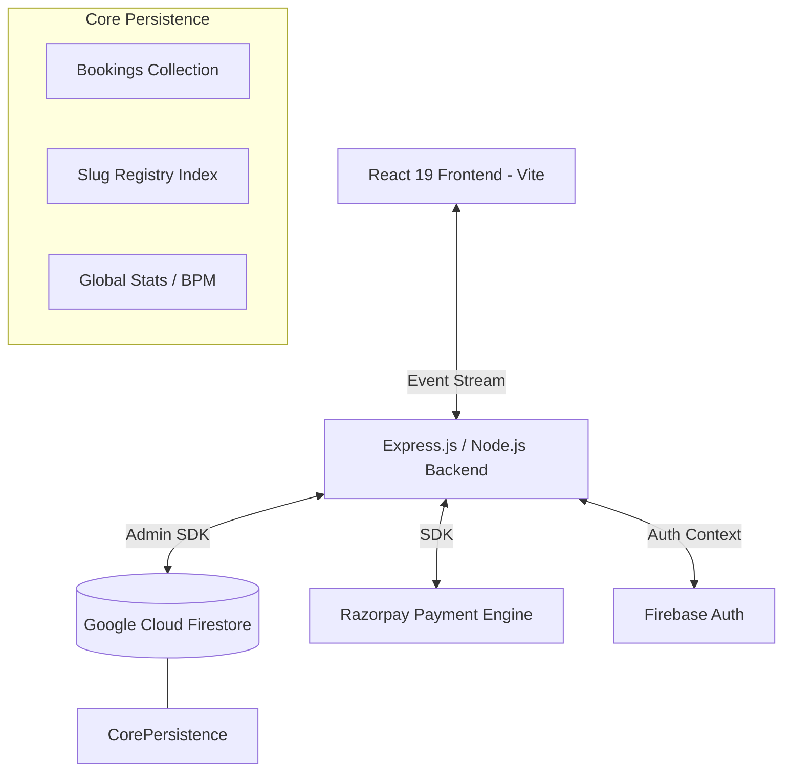
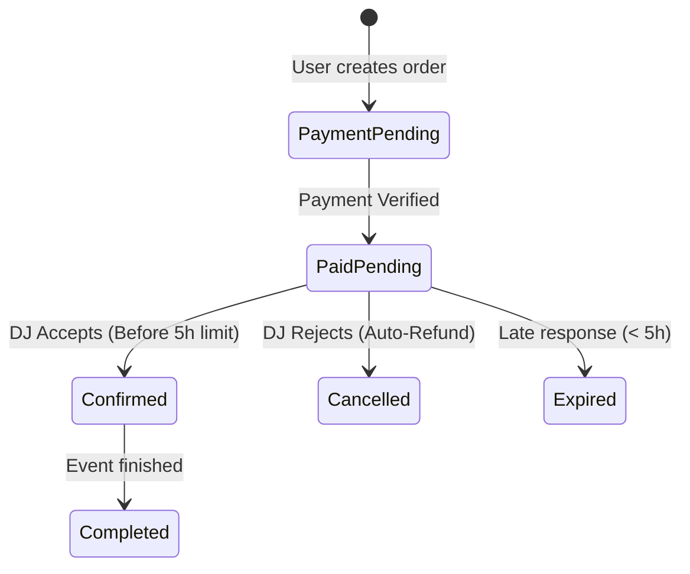

# 🎧 DJ Night: Enterprise-Grade Booking Marketplace

**Orchestrating World-Class Talent with Surgical Precision and Real-Time Fluidity.**

[](https://www.typescriptlang.org/)
[](https://reactjs.org/)
[](https://vitejs.dev/)
[](https://nodejs.org/)
[](https://firebase.google.com/)
[](https://razorpay.com/)

DJ Night is a high-performance orchestration platform designed for premium event booking. It bridges the gap between elite musical talent and high-end event organizers using a low-latency, event-driven architecture and a state-of-the-art glassmorphic user interface.

---

## 🏛️ System Architecture

The platform follows a **decoupled, event-driven architecture** ensuring seamless synchronization and enterprise-grade scalability.



---

## ✨ Feature Breakdown

### 🤵 For Event Organizers (Users)
- **Visual Discovery**: Browse an elite pool of DJs with rich profile cards.
- **Surgical Booking Flow**: Select dates and locations with a 5-hour safety buffer validation.
- **Secure Transactions**: Integrated Razorpay payment engine with server-side validation.
- **Real-Time Signal Ingress**: Watch booking statuses transition from `payment_pending` to `confirmed` in real-time.
- **Consumer Protection**: Automatic refunds initiated immediately upon DJ rejection.

### 🎧 For DJ Professionals
- **Signal Ingress Dashboard**: Manage incoming requests with a 5-hour "Safe Zone" time constraint.
- **Atomic Profile Config**: Unified system for managing Genre, Rates, Bio, and unique Slugs.
- **Global BPM Signature**: Every DJ receives a unique, sequence-safe BPM identifier (starting at 141) via atomic transactions.
- **Intelligence Dashboard**: Real-time analytics tracking Total Revenue and Confirmed Bookings.
- **Slug Management**: Claim and update unique URL slugs (e.g., `/dj/techno-king`) with automated registry cleanup.

---

## 🔄 Business Logic & State Machines

### 🎫 Booking Lifecycle
The system employs a sophisticated 3-stage payment and acceptance flow:



### 💸 Payment & Refund Flow
We prioritize financial integrity by never trusting frontend values.
1. **Server-Side Pricing**: Rates are fetched from Firestore and recalculated on the backend before creating a Razorpay order.
2. **Escrow-like Logic**: Payments are verified via cryptographic signatures before a booking is moved to the "Pending" state for DJ review.
3. **Automated Reversals**: If a DJ rejects a booking, a backend-initiated `razorpay.payments.refund` call is triggered instantly.

---

## 🏗️ Technical Implementation

### Core Persistance Layers (Firestore NoSQL)
- **`bookings/`**: The primary transaction record containing `paymentId`, `orderId`, and current `status`.
- **`slugs/`**: A unique registry index for constant-time (O(1)) lookups of custom DJ URLs.
- **`metadata/dj_stats`**: A high-consistency document used for atomic incrementing of global BPM signatures.

### Security Controls
- **RBAC (Role-Based Access Control)**: Custom middleware ensuring DJs cannot access user data and vice-versa.
- **Transaction Safety**: `db.runTransaction` utilized for profile creation to prevent race conditions during concurrent sign-ups.
- **Input Sanitization**: Client-side slugification and backend regex validation for all persistent fields.

---

## 🛠️ Technology Stack

| Layer | Technologies | Why? |
| :--- | :--- | :--- |
| **Frontend** | React 19, Vite, TypeScript | Modern, type-safe, sub-second HMR. |
| **Styling** | Vanilla CSS + Tailwind | Premium glassmorphism and motion control. |
| **Backend** | Node.js (ESM), Express 5 | Ultra-fast execution with modern JS features. |
| **Database** | Google Cloud Firestore | NoSQL flexibility with real-time snapshot support. |
| **Payments** | Razorpay SDK | The gold standard for localized payment orchestration. |
| **Auth** | Firebase Identity | Secure, scalable identity management. |

---

## 🚀 Deployment & Installation

### 1. Build & Setup
```bash
git clone https://github.com/NITESH-DANGI/DJ-night.git
cd DJ-night
# Install ecosystem dependencies
(cd backend && npm install)
(cd frontend && npm install)
```

### 2. Environment Tuning
Configure the `.env` in the `backend/` directory:
```env
PORT=5000
FIREBASE_API_KEY=your_web_api_key
RAZORPAY_KEY_ID=your_id
RAZORPAY_KEY_SECRET=your_secret
```

### 3. Execution Engines
- **Backend Hub**: `npm run dev` (from /backend)
- **Frontend SPA**: `npm run dev` (from /frontend)

---

## 📜 Roadmap & Scalability
- **Elastic Search**: Migrating DJ discovery to Algolia for advanced filtering.
- **Push Notifications**: Integrating FCM for mobile-native alerts.
- **Global Expansion**: Multi-currency support via Razorpay Global.

---

Distributed under the **ISC License**. Designed for the global music community with a focus on **Visual Design, Real-Time Performance, and Security.**
