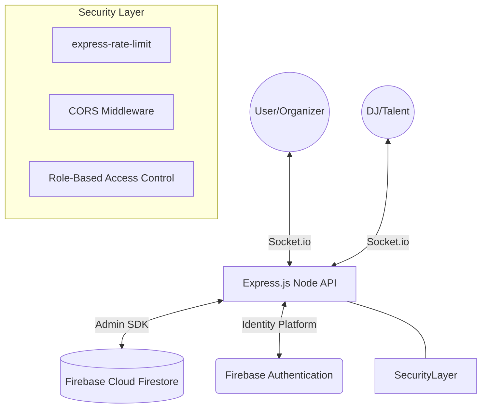

# 🎧 DJ Night - Premium Real-Time Booking Ecosystem

[](https://www.typescriptlang.org/)
[](https://nodejs.org/)
[](https://expressjs.com/)
[](https://firebase.google.com/)
[](https://socket.io/)

**Elevate your events with surgical precision.** DJ Night is a high-performance, real-time booking orchestration platform designed to bridge the gap between world-class talent and premium event organizers. Built with a focus on low-latency synchronization, multi-layered security, and enterprise scalability.

---

## 🏗️ System Architecture

The platform leverages an asynchronous, event-driven architecture to ensure seamless real-time interactions between Users and DJs.



---

## 🔥 Core Capabilities

### ⚡ Real-Time Booking Orchestration
*   **Instant Notifications**: Powered by WebSockets (Socket.io) for immediate booking requests and status updates.
*   **State Synchronization**: Bi-directional data flow ensuring both parties see the same status in real-time.
*   **Lifecycle Management**: Comprehensive state machine for bookings (Pending → Confirmed → Completed → Cancelled).

### 🛡️ Enterprise-Grade Security Implementation
*   **Multi-Layered Rate Limiting**: 
    *   *Global Layer*: Protects the entire API from volumetric attacks.
    *   *Authentication Guard*: Aggressive limits on sensitive endpoints to mitigate brute-force vectors.
*   **Firebase Identity Integration**: JWT-based verification using the Firebase Admin SDK.
*   **Granular RBAC**: Strict Role-Based Access Control enforcing permission sets for `Users`, `DJs`, and `Admins`.

### 📊 Advanced Discovery Engine
*   **Dynamic Filtering**: Efficient queries against Firestore for location, pricing, and performance ratings.
*   **Analytics Pipeline**: Real-time tracking of booking conversion and revenue metrics for DJs.

---

## 🛠️ Technical Stack

- **Runtime**: [Node.js](https://nodejs.org/) (ESM environment)
- **Language**: [TypeScript](https://www.typescriptlang.org/) (Strict type-safety)
- **Framework**: [Express.js](https://expressjs.com/)
- **Infrastructure**: [Google Firebase](https://firebase.google.com/) (Firestore, Auth, Admin SDK)
- **Sockets**: [Socket.io](https://socket.io/) (Real-time events)
- **Middleware**: `express-rate-limit`, `cors`, `dotenv`

---

## 🚀 Deployment & Setup

### 1. Repository Initializaiton
```bash
git clone https://github.com/NITESH-DANGI/DJ-night.git
cd DJ-night/backend
npm install
```

### 2. Environment Configuration
Create a `.env` file in the `backend/` directory:
```env
PORT=5000
# Production specific environment configurations
```
> [!IMPORTANT]
> Ensure your `serviceAccountKey.json` is located in the `backend/` root for Firebase Admin connectivity.

### 3. Execution Engines
*   **Development**: Hot-reloading with TypeScript watch mode.
    ```bash
    npm run dev
    ```
*   **Production**: Compile to optimized JavaScript and execute.
    ```bash
    npm run build
    npm start
    ```

---

## 📡 API Technical Reference

| Endpoint | Method | Security | Description |
| :--- | :--- | :---: | :--- |
| `/api/auth/register` | `POST` | `AuthLimiter` | Identity creation & onboarding |
| `/api/auth/login` | `POST` | `AuthLimiter` | Session establishment |
| `/api/djs` | `GET` | `Public` | Discover and filter DJ pool |
| `/api/bookings` | `POST` | `JWT Required` | Initialize booking transaction |
| `/api/admin/*` | `ALL` | `Admin RBAC` | System-level administration |

---

## 🛡️ Security Posture

This implementation follows the **Least Privilege Principle**. Every request is scrutinized by:
1.  **Rate Limiters**: Preventing DoS and resource exhaustion.
2.  **CORS Policies**: Strict origin validation.
3.  **Firebase Security Rules**: (Infrastructure level) Deep-packet data validation.
4.  **JWT Middleware**: Verifying identity and role integrity.

---

## 📜 License

Distributed under the **ISC License**. Designed with a focus on performance and reliability for the global music community.
